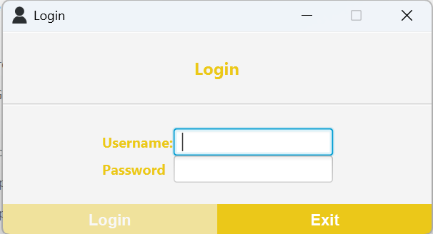
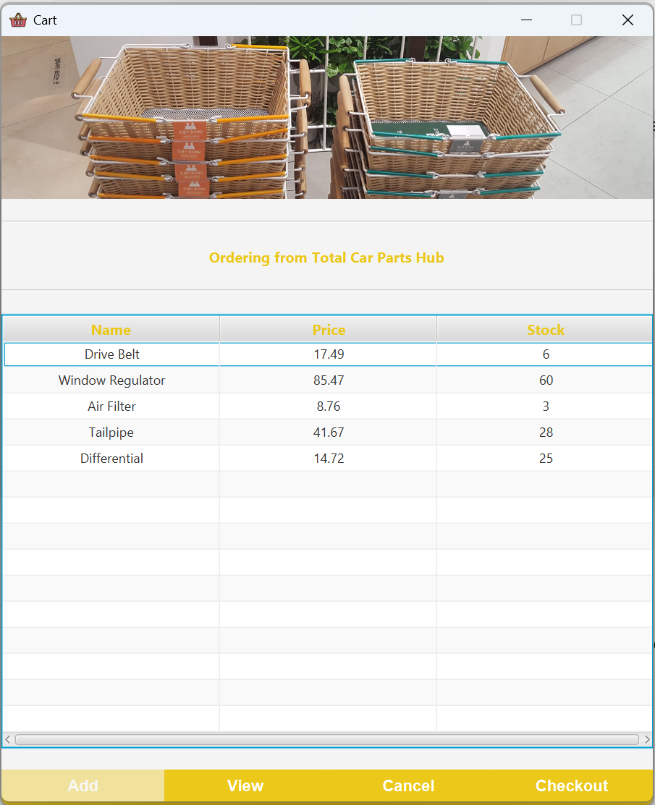
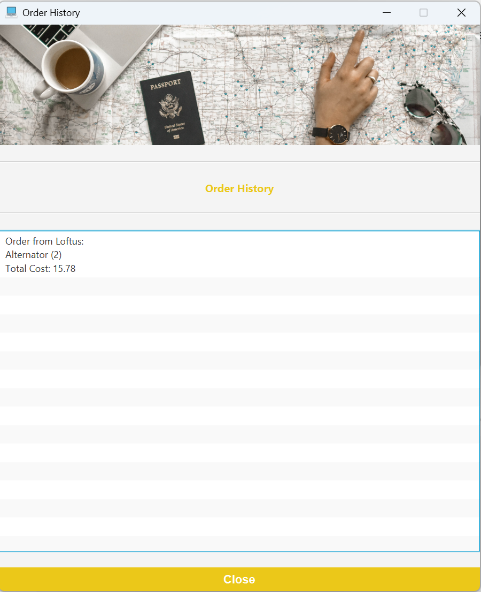

# Order Manager (Java GUI Project)

## A JavaFX GUI application that simulates an online shopping experience. Showcases real-world features like shopping carts, supplier inventory, and order history.

# Features

- Login system with username/password
- Supplier selection and product list display
- Add to cart, remove from cart, and view cart
- Checkout with total price calculation
- View past order history
- Login as either customer or manager

# Screenshots

## Login Screen

## Dashboard

## Cart

## Order Summary

# How to Run
1. Download the raw "Amazon" JAR file.
2. Use Username: "1", Password: "1" for Customer, alternative Username: "3", Password: "3"
3. Use Username: "2", Password: "2" for Manager, alternative Username: "admin", Password: "admin"

# Author
- Bill Ren
