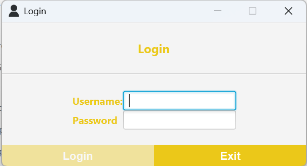
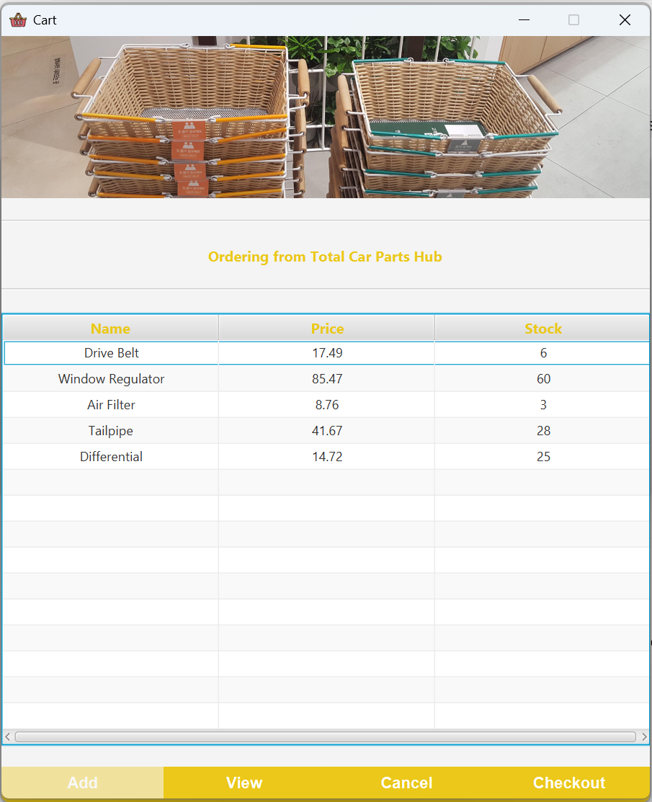
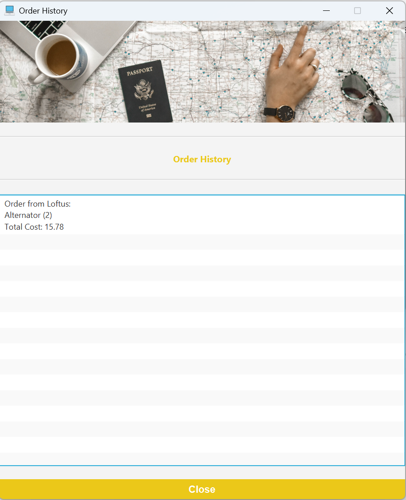

# Order Manager (Java GUI Project)

## A Java Swing GUI application that simulates an online shopping experience. Began as part of a university assignment and improved to showcase real-world features like shopping carts, supplier inventory, and order history.

# Features

- Login system with username/password
- Supplier selection and product list display
- Add to cart, remove from cart, and view cart
- Checkout with total price calculation
- View past order history
- Login as either customer or manager


# Screenshots

## Login Screen


## Dashboard


## Cart


## Order Summary



# How to Run

1. Open a terminal in the project folder.
2. Compile the Java files:
   ```bash
   javac -d bin src/**/*.java
```
3. Run the program:
   ```bash
   java -cp bin your.main.ClassName


# Author
- Bill Ren